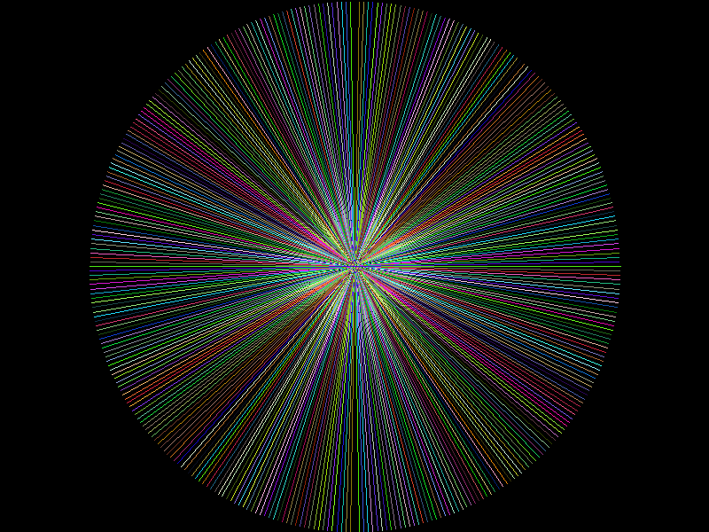

# FIG (Fortran Intuitive Graphics)
FIG is a proof-of-concept library for Fortran that aims to provide intuitive graphics capabilities. It offers basic 2D primitives such as lines, circles, and rectangles for creating graphical representations within Fortran programs.

### Gallery:
Below are some examples of images created using FIG:

1.  - A checkerboard pattern demonstrating FIG's ability to create geometric designs.
2.  - An arrangement of circles showcasing FIG's capabilities in drawing basic shapes.
3.  - A simple graphic of a green blob illustrating FIG's versatility in creating varied visual elements.
4.  - Radial lines extending from a central point, demonstrating FIG's ability to generate complex patterns.
5.  - A basic rectangle shape created using FIG's rectangle drawing function.
6.  - An example of a smiley face drawn using FIG's primitives.

