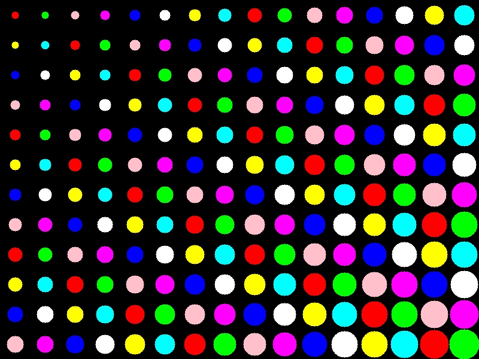

# FIG (Fortran Intuitive Graphics)
FIG is a proof-of-concept library for Fortran that aims to provide intuitive graphics capabilities. It offers basic 2D primitives such as lines, circles, and rectangles for creating graphical representations within Fortran programs.

### Gallery:
Below are some examples of images created using FIG:

|   |   |
|---|---|
|  |  |
|  |   |
|  |  |

you can generate them yourself using `fpm test`
