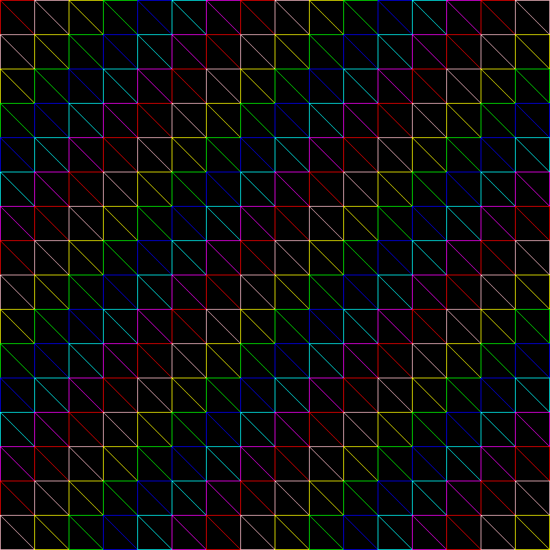
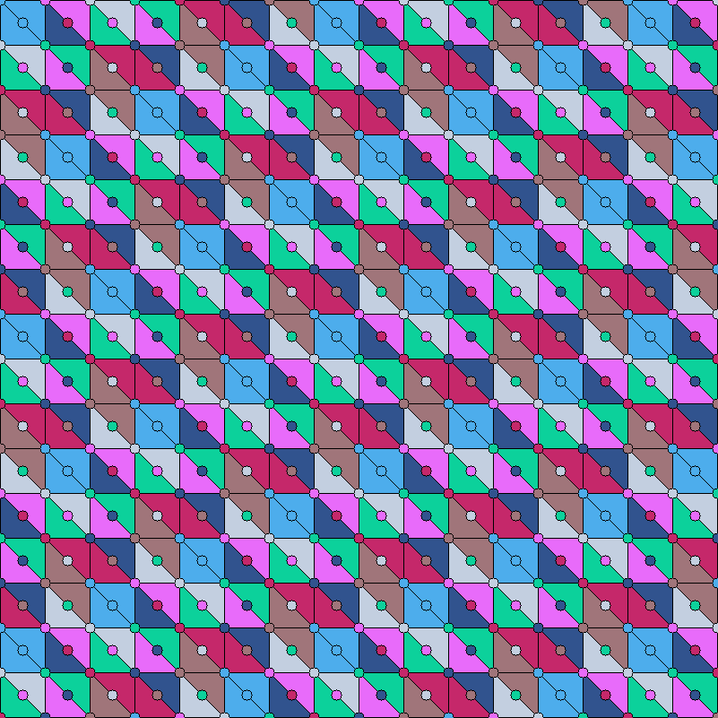
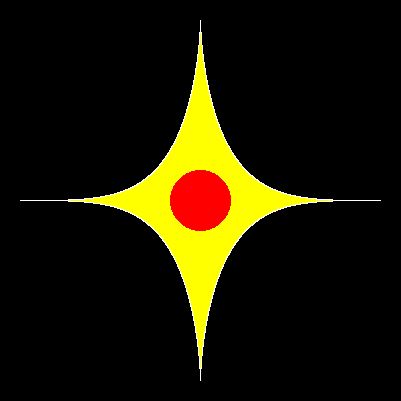

# FIG (Fortran Intuitive Graphics)
FIG is a Fortran library for that aims to provide intuitive graphics capabilities.
Currently It offers basic 2D primitives such as lines, circles, ellipsis, triangles, and rectangles for creating graphical representations within Fortran programs.

### Gallery:
Below are some examples of images created using FIG:

|   |   |
|---|---|
|  |  |
|  |   |
| | |
| | |

you can generate them yourself using `fpm test`

### todo
- [x] better cirlces drawing and filling 
- [ ] pro drawing for rectangle the supports rotating and such
- [ ] support png and the alpha channel

