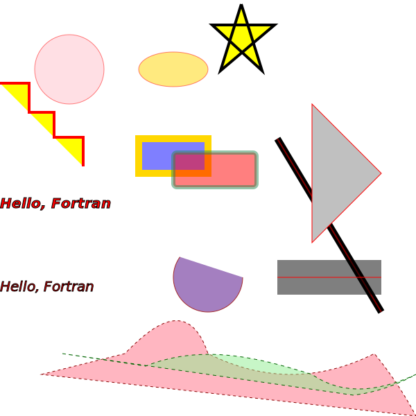

# FIG
FIG is a Fortran library designed to offer intuitive vector graphics capabilities.
It supports a variety of shapes, paths, and text, with output options including PNG, PPM, and SVG.

## Features
- **Shape Drawing**: Easily draw paths, shapes, and curves.
- **Styling**: Apply stroking, dashing, and other styles to shapes.
- **Text Support**: Render fonts and text with customizable attributes.
- **Export Options**: Save your graphics in PNG, PPM, or SVG formats.

## Requirements
- A modern Fortran compiler (such as gfortran).
- `libcairo` and its dependencies for rendering. [Install libcairo](https://www.cairographics.org/download/).

## Example program

Here’s a simple example to get you started:
```fortran
program test_fig
   use fig
   implicit none
   type(drawing) :: canva
   type(circle) :: circ

   call canva%init()
   canva%background = FIG_COLOR_BLACK

   circ%c%x = 0.5
   circ%c%y = 0.5

   circ%r = 25
   circ%stroke_color = FIG_COLOR_TAN
   circ%fill_color = FIG_COLOR_RED
   circ%stroke_width = 3
   call canva%add_shape(circ)

   circ%r = 15
   circ%stroke_color = FIG_COLOR_CYAN
   circ%fill_color = FIG_COLOR_GRAY
   circ%stroke_width = 2
   call canva%add_shape(circ)

   ! Export the drawing to PNG and SVG formats
   call draw_to_png(canva, 100, 100, "png_test")
   call draw_to_svg(canva, 200, 300, "svg_test")

end program test_fig
```
result : 


**Note**: FIG uses relative coordinates by default. To use absolute coordinates, set `FIG_ABSOLUTE_COORDINATES = .true.`.

For a comprehensive list of shapes and their attributes, refer to the [Shapes source file](https://github.com/AnonMiraj/fig/blob/main/src/backends/fig_shapes.f90) and [Path source file](https://github.com/AnonMiraj/fig/blob/main/src/backends/fig_path_shape.f90).

## Gallery
Below are some examples of images created using FIG.



<details>
  <summary>More Examples</summary>


</details>

## fpm
To use fig within your own `fpm` project, add the following dependency to your project `fpm.toml` file:

```toml
[dependencies]
fig= {git = "https://github.com/AnonMiraj/fig" }
```


## To-Do List
- [ ] Add support for additional backends, making `cairo` optional.
- [ ] Implement gradient support.
- [ ] Add PNG file reading capability.
- [ ] Implement transformations (rotations, scaling, etc.).


